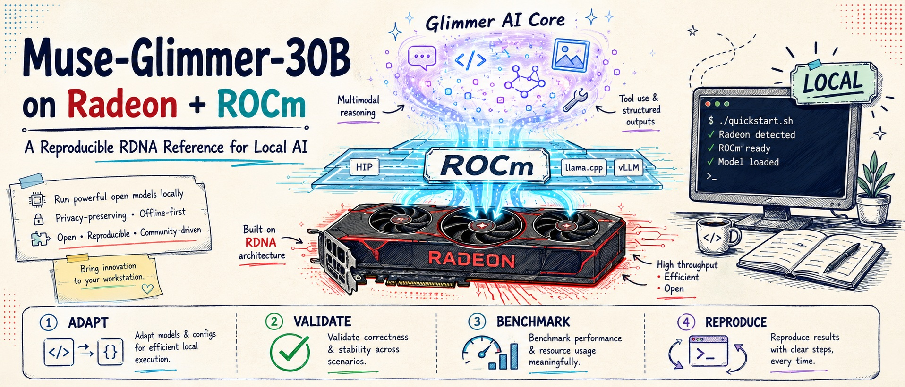

# Muse-Glimmer-30B-ROCm

[](https://github.com/AIwork4me/Muse-Glimmer-30B-ROCm/actions/workflows/ci.yml)
[](LICENSE)

> **The reproducible RDNA reference for Meta Muse-Glimmer-30B — from
> MI-series recipes to Ryzen AI and Radeon.**



**What you get:**

- Run a ~30B multimodal reasoning/tool-use model **locally on validated Ryzen
  AI-class hardware** (Radeon 8060S, `gfx1151`) with a one-command quickstart.
- **Measured, not guessed, speedups** — DFlash speculative decoding delivers
  **2.2–2.5× single-stream**; concurrency tradeoffs are benchmarked, including
  the pitfalls (see [known good and known bad](#known-good-and-known-bad)).
- A reviewed **[CDNA → RDNA adaptation map](docs/adaptation.md)** — reuse the
  engineering delta instead of rediscovering it.
- **Evidence-first claims**: every number links to raw cells with exact flags,
  hashes and manifests. Failures are preserved as findings, not hidden.
- A protocol to **contribute Radeon evidence that is comparable** rather than
  anecdotal ([hardware validation](docs/hardware-validation.md)).

Method: **Adapt → Validate → Benchmark → Explain → Reproduce.**

<!-- BEGIN GENERATED: validated-platform -->
**Actually validated here:** AMD Ryzen AI MAX+ PRO 395 / Radeon 8060S,
`gfx1151` (RDNA 3.5). Every additional platform remains evidence-gated by the matrix below.
<!-- END GENERATED: validated-platform -->

## Performance highlights

gfx1151 rows validated on **ROCm 7.14.0** via the GGUF/llama.cpp matrix
([`docs/results/matrix-714/`](docs/results/matrix-714/)). The W7900
(`gfx1100`) rows are a separate community-validated track on ROCm 7.2.4
([W7900 results](docs/results/w7900-gfx1100.md)).

**Single-stream (Study 1, greedy, Meta-aligned DFlash anchor):**

| Configuration | Baseline | DFlash | Speedup |
|---|---:|---:|---:|
| gfx1151, K-Quant-17GB | 10.42 tok/s | 23.08 tok/s | **2.22×** |
| gfx1151, dynamic K-Quant | 9.11 tok/s | 22.49 tok/s | **2.47×** |
| W7900 (`gfx1100`), K-Quant-17GB | 33.31 tok/s | 62.03 tok/s | **1.86×** |

W7900 rows: independently reproduced 2026-08-16 on a second W7900 host
(ROCm 7.2.1, upstream llama.cpp at the validated pin) with draft acceptance
~0.24 — raw cells:
[`cells-rocm-7.2.1`](docs/results/hardware-validation/w7900-gfx1100/cells-rocm-7.2.1/).
DFlash scales a bit less than on gfx1151 because the desktop card's much
faster baseline is less memory-bound.

A **methodology-aligned** comparison, not an identical reproduction — Meta did
not publish its prompt corpus. The recorded arithmetic smoke check is
byte-identical under greedy decoding; no broader equivalence claim is made
([details](docs/results/benchmark.md)).

**Throughput under load (Study 2, aggregate tok/s):**

`c` is llama.cpp concurrency (`-np`). gfx1151 `c=1`/`c=4` are ROCm 7.14
values; `c=16` is 7.2.1-only (⚠). The W7900 (`gfx1100`) rows are a separate
community-validated Radeon dGPU track (ROCm 7.2.4), extended to `c=32`.

| GPU | Weight | c=1 baseline / DFlash | c=4 baseline / DFlash | c=16 baseline | c=32 baseline |
|---|---|---:|---:|---:|---:|
| gfx1151 | 17GB | 10.50 / 21.37 | 21.93 / 32.42 | 34.47 ⚠ | — |
| gfx1151 | dynamic | 9.21 / 19.69 | 20.99 / 31.10 | 31.05 ⚠ | — |
| W7900 (`gfx1100`) | 17GB | 33.72 / 56.35 | 66.46 / 77.44 | 218.56 | 293.29 |
| W7900 (`gfx1100`) | dynamic | 30.61 / 51.92 | 65.63 / 71.51 | 209.65 | 265.71 |

The W7900 runs ~3.2–3.4× the gfx1151 APU at `c=1` and up to ~6.8× at `c=16`
(dedicated GDDR6 vs unified LPDDR5X); peak VRAM ≤ 24.9 GiB of 48. Full detail,
recommended W7900 serving presets and reproduction:
[W7900 results](docs/results/w7900-gfx1100.md) ·
[`scripts/w7900-repro/`](scripts/w7900-repro/).

⚠ c=16 is **ROCm 7.2.1-only** (deferred on the 7.14 reduced matrix); c=1/c=4
are 7.14 values. DFlash at c=16 is pathological — see
[known good and known bad](#known-good-and-known-bad). Study 3 validated the
vision path (image-conditioned generation through `mmproj`); raw cells retain
no response text, so it is functional-path evidence.

Cross-ROCm check ([comparison](docs/results/matrix-714/comparison.md)):
Mean TPOT delta versus 7.2.1 was -0.4% at `np=1` and -1.7% at `np=4`;
individual cells ranged from -6.4% to +9.0% and -5.4% to +0.2%,
respectively. The comparable np=16 baseline pairs averaged +15.5%.

Full definitions, raw JSON, variance and negative cells:
[benchmark report](docs/results/benchmark.md) ·
[methodology](docs/results/METHODOLOGY.md) ·
[ROCm 7.14 matrix](docs/results/matrix-714/) ·
[historical 7.2.1 matrix](docs/results/matrix/) ·
[validation-track index](docs/results/README.md).

## Quick start — Ryzen AI, ROCm 7.14, GGUF

```bash
git clone https://github.com/AIwork4me/Muse-Glimmer-30B-ROCm.git
cd Muse-Glimmer-30B-ROCm
bash scripts/install-rocm-7.14.sh
bash scripts/00-check-env.sh
bash scripts/gguf-quickstart.sh
# OpenAI-compatible server: http://127.0.0.1:8080
# Leave this terminal running (Ctrl-C stops the server); open a second
# terminal for the verification requests below.
```

### Verify it works

From that second terminal:

```bash
curl http://127.0.0.1:8080/health
# {"status":"ok"}

curl http://127.0.0.1:8080/v1/chat/completions \
  -H 'Content-Type: application/json' \
  -d '{"messages":[{"role":"user","content":"Reply with exactly: OK"}],"max_tokens":512}'
```

The visible answer arrives after ~50–70 hidden reasoning tokens.

> **Muse-Glimmer is reasoning-first:** it writes hidden chain-of-thought
> (`reasoning_content`) before any visible `content`, so a small `max_tokens`
> (e.g. 16) spends the whole budget on reasoning and returns empty `content`
> with `finish_reason:"length"` — HTTP 200, no error. Use `max_tokens` ≥ 512
> or omit it ([details](docs/troubleshooting.md#reasoning-length)).

Optional features use the same path, each adding one manifest-verified
download (~1.3 GiB image projector, ~1.5 GiB DFlash drafter) on first use:

```bash
WITH_MMPROJ=1 bash scripts/gguf-quickstart.sh  # image input
WITH_DFLASH=1 bash scripts/gguf-quickstart.sh  # single-stream speculative decoding
```

Prerequisites, download sizes, installer internals, the confirmed-download
wrapper and the reproducibility knobs are in
[getting started — details](docs/getting-started.md).

## Serving paths

| Path | Best for | Status |
|---|---|---|
| **llama.cpp + Meta GGUF** | Single-user chat, low-memory onboarding | Default; project-validated on ROCm 7.14 |
| **vLLM + BF16** | Multi-user serving, agentic tool parsing, 128K context | Optional / not prioritized for v0.1; ROCm 7.14 Muse-Glimmer validation pending |

**Recommended stack: ROCm 7.14.0** (an AMD-supported gfx1151 release), with
the **llama.cpp / GGUF** path as the default for single-user scenarios. ROCm
7.2.1 is preserved as the fully-validated historical reference.

The optional vLLM path has separate Python 3.12, `uv`, TheRock PyTorch and
memory prerequisites ([details](docs/getting-started.md#prerequisites)):

```bash
uv sync --locked
ROCM_PREFIX=/opt/rocm bash scripts/00-check-env.sh --profile vllm
bash scripts/01-build-vllm.sh
bash scripts/02-fetch-model.sh
bash scripts/03-serve-vllm.sh
# OpenAI-compatible server: http://127.0.0.1:8000
```

The upstream model-support [PR #51655](https://github.com/vllm-project/vllm/pull/51655)
is open and remains a separate dependency; AMD's ROCm platform support does
not imply Muse-Glimmer model support in vLLM. Historical vLLM/BF16 validation
(reasoning + ATEM tool parsing, vision, 128K context, continuous batching)
remains available on the ROCm 7.2.1 reference — see the
[validation-track index](docs/results/README.md) and the
[ROCm 7.14 scoped result](docs/results/rocm-7.14/README.md) for the full
status and the rocBLAS proxy that shaped this prioritization.

## Validation status

### Hardware matrix

<!-- BEGIN GENERATED: hardware-matrix -->
| Status | Platform | Evidence |
|---|---|---|
| ✅ **Validated** | Ryzen AI MAX+ PRO 395 / Radeon 8060S, `gfx1151` | [Recorded project evidence](configs/validated-stack.json) |
| 🧪 **Community validated** | Radeon W7900, `gfx1100` | [Accepted evidence bundle](docs/results/hardware-validation/w7900-gfx1100/manifest.json) |
| 🚧 **Planned** | Other RDNA3 / future RDNA4, `various` | Requires a comparable community submission |
| 📘 **Upstream recipe** | MI300X / MI355X, `CDNA` | Upstream evidence; not revalidated here |
<!-- END GENERATED: hardware-matrix -->

`🧪 Community validated` is reserved for a submission that includes the
required manifest, command, logs and results. See
[hardware-validation.md](docs/hardware-validation.md) to add one. AMD's
[platform support](https://rocm.docs.amd.com/en/docs-7.14.0/about/release-notes.html)
for `gfx1151` is distinct from the workload validation and benchmark evidence
produced independently by this project.

### ROCm validation tracks

<!-- BEGIN GENERATED: validation-tracks -->
- **ROCm 7.14 gfx1151 (recommended default):** the reduced **GGUF/llama.cpp
  matrix is project-validated** on Ryzen AI MAX+ PRO 395 / Radeon 8060S,
  19 of 21 planned cells; of the four `np=16` cells, both
  baselines were measured 2026-08-15 (healthy, fixed SSE-framing client) and the
  2 DFlash cells remain deferred (pathological scope). **Optional / not prioritized for v0.1; ROCm 7.14
  Muse-Glimmer vLLM validation pending.** Current rocBLAS BF16-GEMM proxy results did not
  justify prioritizing a 7.14 rebuild; vLLM/BF16 stays validated on the 7.2.1 reference, so
  ROCm 7.14 is not presented as a globally validated replacement for the historical stack.
- **ROCm 7.2.1 (historical reference, supplementary):** the full validated stack —
  the complete benchmark matrix, the vLLM-vs-llama.cpp head-to-head, and llama-bench — is
  preserved as immutable evidence. No result is relabeled or overwritten.
<!-- END GENERATED: validation-tracks -->

See [ROCm 7.14 scoped validation](docs/results/rocm-7.14/README.md) and its
[machine-readable manifest](configs/rocm-7.14-gguf-validation.json).

### Known good and known bad

| Configuration | Status |
|---|---|
| vLLM BF16 + `TRITON_ATTN` + TP=1 | Validated on the **7.2.1 reference**; ROCm 7.14 Muse-Glimmer validation pending |
| llama.cpp HIP + 17GB/dynamic K-quant | Validated on `gfx1151` |
| llama.cpp DFlash, c=1 or light c≤4 | Validated; speedup depends on workload |
| `-md dflash.gguf` without `--spec-type draft-dflash` | Silent no-op; do not use |
| DFlash + `-np 16` | Pathological; one cell aborted after 5 h 16 m; root cause diagnosed and [reported upstream](https://github.com/ggml-org/llama.cpp/issues/27117) |
| AITER or FP8 vLLM paths on `gfx1151` | Not supported by this validated stack |
| llama.cpp HIP + 17GB/dynamic K-quant on `gfx1100` (W7900) | Validated (Study 2 throughput; DFlash helps at c≤4) |
| Other RDNA3 / RDNA4 dGPUs | Pending evidence |

**Negative results are results.** The project preserves the silent-DFlash
discovery, non-completing c=16 cells, backend failures and measurement
limitations because they prevent other developers from repeating the same
mistakes — start from [troubleshooting](docs/troubleshooting.md) before
re-running into a known wall.

## Requirements

- Kernel **≥ 6.16.9** on the validated Strix Halo host (avoids the observed
  UMA/KFD issue; not a universal ROCm floor —
  [AMD's RDNA3.5 requirements](https://rocm.docs.amd.com/en/latest/reference/system-optimization/rdna3-5.html)).
- ~20 GiB disk for the default GGUF path; ≥60 GiB GPU-visible unified memory
  for the validated BF16 path; the ROCm installer needs ~11 GiB free at its
  transient peak.
- `git`, `cmake`, `curl`, Python 3 and a gfx1151-capable HIP toolchain
  (per-distro commands and details:
  [getting started](docs/getting-started.md#prerequisites)).

Setup and failure modes: [Strix Halo setup](docs/strix-halo-setup.md) ·
[troubleshooting](docs/troubleshooting.md) ·
[adaptation map](docs/adaptation.md).

## Documentation

| Document | What's inside |
|---|---|
| [Getting started — details](docs/getting-started.md) | Prerequisites, installer internals, download sizes, reproducibility knobs and overrides |
| [Benchmark report](docs/results/benchmark.md) | Headline tables, best-practice configurations, the c16+DFlash warning |
| [Methodology](docs/results/METHODOLOGY.md) | Study definitions, metrics, [memory methodology](docs/results/METHODOLOGY.md#memory-methodology) |
| [Results index](docs/results/README.md) | Validation-track boundaries, historical vs forward evidence |
| [Adaptation map](docs/adaptation.md) | Every CDNA → RDNA delta, classified by durability |
| [Troubleshooting](docs/troubleshooting.md) | Symptom → cause → fix for every observed failure |
| [Hardware validation](docs/hardware-validation.md) | How to add your platform as community evidence |

## Contributing and security

Read [CONTRIBUTING.md](CONTRIBUTING.md) before submitting hardware or benchmark
claims. Use the issue templates for bugs, regressions, platform requests and
hardware validation. Report security issues through [SECURITY.md](SECURITY.md).

## License and acknowledgements

Repository code is [Apache-2.0](LICENSE). Model artifacts are published by Meta
under Apache-2.0 with a separate usage policy; downloading them means accepting
that policy.

Thanks to Meta for Muse-Glimmer-30B and its model artifacts, vLLM and llama.cpp
contributors for the inference implementations, and AMD TheRock/ROCm
contributors for the `gfx1151` runtime and toolchain work.
